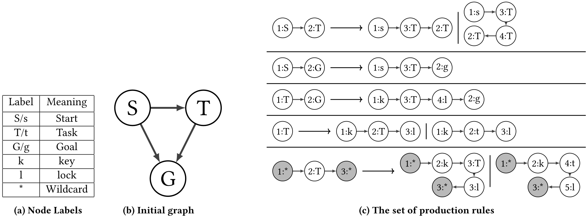
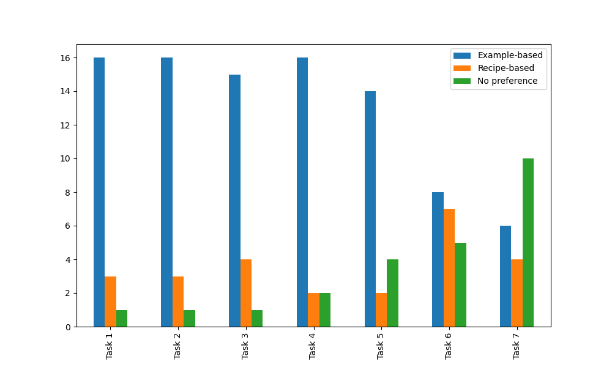
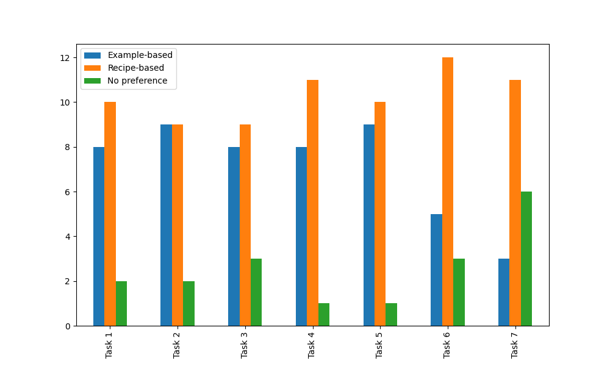
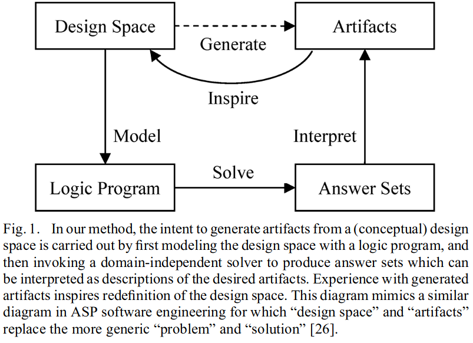
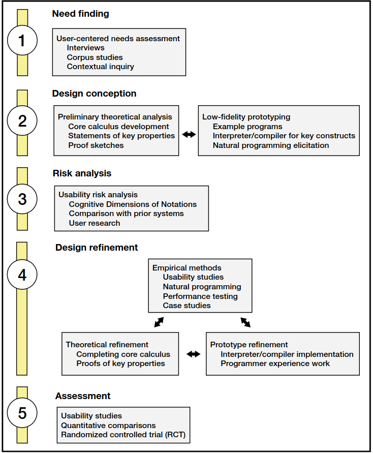

---
# try also 'default' to start simple
theme: default
# random image from a curated Unsplash collection by Anthony
# like them? see https://unsplash.com/collections/94734566/slidev
background: https://source.unsplash.com/collection/94734566/1920x1080
# apply any windi css classes to the current slide
class: 'text-center'
# https://sli.dev/custom/highlighters.html
highlighter: shiki
# show line numbers in code blocks
lineNumbers: false
# some information about the slides, markdown enabled
info: |
  ## Slidev Starter Template
  Presentation slides for developers.

  Learn more at [Sli.dev](https://sli.dev)
# persist drawings in exports and build
drawings:
  persist: false
# page transition
transition: slide-left
# use UnoCSS
css: unocss
---

# Covering Designers' Bayes-ic Needs: Probabilistic Logic Programming for Content Generation in Games 

<!--
The last comment block of each slide will be treated as slide notes. It will be visible and editable in Presenter Mode along with the slide. [Read more in the docs](https://sli.dev/guide/syntax.html#notes)
-->

---

# Example: Grid-Based Level Generation

<OneGrid grid_num="15" size="95" />

---

# Why PCG?

## Labor 

<v-clicks>

- Reduce (undesirable?) work done by game development and so.... 
- Reduce costs of game dev
- Create value for shareholders 

</v-clicks>

## Artistic 

<v-clicks>

- Holodeck babyyyyy
- Simulate my hair follicle's life story
- As a tool for game design 

</v-clicks>

<!--
Here is another comment.
-->

---

# Why is PCG not more widespread?

<v-clicks>

- Most work is focused on level generation -- domain restriction
- Defining a good generator is hard -- expertise restriction
  - Twice the amount of levels for at least twice the amount of work! Guaranteed!
  - Creating interesting content generators requires a large amount of expertise outside of game design

</v-clicks>

---

# Goal

<v-clicks>

- For PCG to be a useful designer tool, there must exist tools that make it more usable. 
	- Namely clear feedback: make it clear how designer input maps out to generator behavior

- Make designers involved not in just the use of content generators but in its core developement.

</v-clicks>

---

# Opinion: Randomness is important to PCG

<v-clicks>

- We want to define a generative space not a single artifact
- We then want to sample from that space
- This involves a form of randomness
- Randomness is hard to reason about

</v-clicks>
<!--
Presenter note with **bold**, *italic*, and ~~striked~~ text.

Also, HTML elements are valid:

  Left content
  Right content

-->

---
class: px-20

---

# How to think about randomness?

<v-clicks>

- What tools do we have to deal with it?
- Bayes rules tbh
- Goal: Leverage existing mathematical formulations of uncertainty to come up with tools that makes reasoning about randomness of generators clearer
- Many existing techniques in AI for dealing with randomness is Bayesed
- Provides an elegant mathematical language for which we can both define our generator and adjust it 

</v-clicks>

---

# Formal definitions: Valid Generator

Let $\Omega$ be the set of possible artifacts, and $\Omega_{V} \subseteq \Omega$ be the set of valid artifacts.
 Then a valid generator is a probability distribution P such that for all $\omega \notin \Omega_{V}$ $P(\omega) = 0$ 

---

# Formal definitions: Quality Constraint

Let $f: \Omega_{V} \rightarrow [0,1]$ be a quality constraint, then a generator $P$ is said to be consistent with the quality constraint f if $P(\omega) = 0$ when $f(\omega) = 0$ for all $\omega \in \Omega_{V}$

---

# Formal definitions: Quality Generator

Let $Q$ be the set of artifacts consistent with a set of quality constraints $F$, $P(Q)$ be the probability that a generator $P$ generates $Q$, $V$ be a set of valid artifacts that $P$ can generate and $P(V)$ the probability that $P$ generates $V$. Then a \emph{quality generator} $P(V \vert Q)$, is defined:  
$$ P(V \vert Q) = \frac{P(Q \vert V)P(V)}{P(Q)}$$
where $P(Q \vert V)$ is the probability of generating a quality artifact given it has generated a valid artifact.

- In Bayesian statistics we refer to $P(V \vert Q)$ as the posterior, $P(Q \vert V)$ the likelihood, $P(V)$ the prior and $P(Q)$ as the marginal.
- Thus, the quality generator is the posterior and the valid generator is the prior. The likelihood captures how likely the generator is to generate quality artifacts given that it has generated a set of valid artifacts $V$.

Make clear that all of this us omega v
make clear that v is a subset of omega v 
have a game examples
what kind of design tasks
have some mention on prior work on MI level design tools
or wave-function collapse

---

# Example: 2x2 Grid

- Let's call this $\Omega$

---
---

# Hard and soft constraints
<v-clicks>

- In the optimization literature there already exists a distinction between *hard* and *soft* constraints
  - Hard constraints :: Constraints that restrict the solution space, i.e. they *have* be satisfied 
  - Soft constraints :: Constraints that are optional but preferred, i.e. they *aught* to be satisfied but don't have to be.
- Solutions are eliminated by using hard constraints and penalized using soft constraints

</v-clicks>

---
---
# Why the distinction between validity/quality and hard/soft?

<v-clicks>

- Validity constraints are hard constraints
  - They need to eliminate non-playable level for example
- Quality constraints can be hard constraints or soft constraints
  - If hard then 
  - They can be an arbitrary combination of both
- We make this distinction for following reasons
  - Separate concerns of validity and quality
  - Allow for generators to have multiple sets of quality constraints under the same validity constraints
- Ultimately a terminology convention, one can make the formulation using hard and soft constraints
  - Whereby hard quality constraints are folded into validity constraints

</v-clicks>

---

# Great but why?

<v-clicks>

- In Bayesian ML we often formulate our models in the form 
$$P(\theta \vert X) = \frac{P(X \vert \theta)P(\theta)}{P(X)}$$
where X is the data and $\theta$ are model parameters. 

- In PCG there exist approaches that use
- PCGML approaches are not always Bayesian and do not guarantee the $P(\theta)$ is *valid*
  - PCGML that are non-Bayesian maximize the likelihood $P(X \vert \theta)$ without any gurantees
  - Do not guarantee playable levels

- Make the distinction between declarative or constructive.
- In declarative and constructive PCG approaches the prior and the likelihood are given implicitly.

- This formulation is useful in both understanding and specifying the randomness of PCG

</v-clicks>

---

# The generation process

<v-clicks>

- Looking at the quality generator
$$ P(V \vert Q) = \frac{P(Q \vert V)P(V)}{P(Q)}$$

- We can view specifying prior $P(V)$ as the way to ensure strong constraints that must hold (i.e. validity)
- We can view specifying the likelihood as altering that distribution towards designer preferences. 
- The questions now is: how do we provide designer-facing tools for specifying the prior and the likelihood?

</v-clicks>

---

# For now assume the prior

<v-clicks>

- There are many existing generative techniques that enforce constraints
  - I.e. specify the prior $P(V)$ 
- They are hard to control
- Generate uninteresting or repeatitive content
  - Most commonly constructive or template technique
- One such technique that has found use in both industry and academia is grammars
</v-clicks>

---

# Generative Grammars

(maybe remove this and just use the grid example to show this)
(The grammar is not relevant to this talk really)
(We can just talk about how the grammar is less expressive than Problog)

<v-clicks>

- Re-writing systems
- Used in many commercial systems like speed tree and city engine
- Often very domain specific

</v-clicks>
<v-click>
  

</v-click>
 
---

# Interface 

https://fdgsubmission.github.io/examples_app/

https://fdgsubmission.github.io/recipes_app/

 
---
---
# Example-based: Learning

Example based mechanism allows designers to specify $P(Q \vert V)$
<v-clicks>
 - Select examples that are relevant to metrics of interest
 - Assumes a multinomial distribution over the rules where the inital parameters are uniform
 - Generator learns the maximum likelihood of the rules' parameters given the selected examples
</v-clicks>
 
---

# Study: Tasks 
Using both interfaces particpants were asked to do the following: 

- Alter the grammar such that it generates graphs of low leniency
- Alter the grammar such that it generates graphs of low mission linearity
- Alter the grammar such that it generates graphs of low map linearity
- Alter the grammar such that it generates graphs of low path redundancy
- Alter the grammar such that it generates graphs of high leniency and high mission linearity
- Alter the grammar such that it generates graphs with few item rooms
- Alter the grammar such that it generates graphs where players have many rooms to explore before running into the mini-boss

---

# Study: Preferences Results

  

  

---

# Study: Performance Results

- Users tended to perform better at design tasks that are defined on the metrics with example-based interface
- Users tended to perform better at design tasks that are not defined on the metrics with recipe-based interface

---

# Limitations

<v-clicks>

- Study was limited: only student game designers and in a classroom context
- The learning mechanism is limited: designers can't move the generative space towards the metrics as much as they want
- Metrics are spherical cows
- Nevertheless it proved a more effective means of controling the randomness; targeting desired areas in the design space.
- Need a more sophiscated back-end to make it work more

</v-clicks>

---

# Defining the prior $P(V)$

<v-clicks>

- Learn it!
  - Well, can't really guarantee playability

- Gimme it!
  - In game's research the more general approach of doing so is via declarative programming 
	
</v-clicks>

---

# Answer Set Programming

  

---

# Answer Set Programming

<v-clicks>

- Elgeant general way for specifying valid design space
  - In our formulation the prior
- Has very nice features that allow for interaction with generative space
- No way of explicitly controlling randomness 
- Diversity is harder to control -- implementation specific

</v-clicks>

---

# Problog

<v-clicks>

- Probabilsitic Logic Programming Language 
- Semantics are defines as a distribution over possibile worlds/initiations of logicial variables.
- Has useful features such as: learning parameters from data, answering probabilistic queries exacly and approximately, compiling program down an efficent data-structure from which sampling is linear. 

</v-clicks>

---

# Limitations

<v-clicks>

- Problog has severe limitations as language for PCG
- API is not very usable (it is in python and not well documented) 
- Performance out of the gate is not great

</v-clicks>

---

# What's next
 
<v-clicks>

- Address Problog's lack of strong negation 
- Implement useful quality of life features for designers
- Do a systematic PL and HCI study on both developing and assessing a language for this niche (using PLIERS for example)

</v-clicks>

---
---

# Strong negation in Problog
 
<v-clicks>

</v-clicks>

---

# Study: Preliminary Design 

We will base our approach to testing and implementing our language design changes using the PLIERS framework
 
<v-clicks>

- Need Finding:
For this step, we plan to conduct a set of user-studies with game design students to help identify features missing from current Problog. Additionally, we will analyze current PCG systems and study how expressable they are in Problog.

- Design Conception:
We will implement the first phase of changes to Problog. Furthermore, we will run additional studies with this prototype to assess our design changes. This will be an iterative procedure as we work closely with a few game design students.

- Risk Analysis:
After we are satisfied with a prototype we will run a user study with more designers, comparing our language with ASP. This study will include practitioners with and without prior ASP experience. 

- Design Refinement:
In this phase we will finalize our changes to Problog and implement them in a wrapper library such that the new language is usable by game developers in their current workflows. We will also prove the validity of any semantic changes we may need to make to Problog to accommodate the desired features. 

- Assessment:
Finally we will run a final usability study with our language and assess how well our language features achieved our goals.

</v-clicks>

  

---
---
# Timeline 
 
<v-clicks>

- May 2023: Submission of preliminary work on Problog at the AIIDE 2023
- August 2023: Recruitment for first user study and pilot testing  
- September 2023: First user study for language usability and identifying needed features (Need finding)
- October 2023: Implementation of negation and other new language features for game design (Design Conception)
- December 2023: Second study with a few PCG practioners (Risk analysis)
- Jan 2024: IJCAI submission on the new language features we introduce
- February 2024: CHI Play submission of the results of the second user study
- March 2024: Second round of major implemention changes (Design Refinement)
- May 2024: Third user study with introduced language features (Assessment)
- June 2024: Thesis Defense 
- September 2024: CHI submission for final assessment on user studies on probabilistic programming languages in games

</v-clicks>

